# my_rpg
Make a rpg game in CSFML

Made with Quentin CAMILLERI, Lucas TESNIER and Thomas PRUDHOMME

Rule of our project:

This project is one of the freest project of your first year. Create your own RPG.

Your main challenge for this game will be to create a complete product using everything that you and your
team know.

Your game must follow the following rules:

     - The player needs to have characteristics which you can find in the status menu.
     - The player can fight enemies, statistics will impact the fights results.
     - There must be NPC in your game.
     - You need to implement at least one quest.
     - The player must have an inventory which can contain a limited set of items.
     - The player can earn experience by winning fights and accomplishing specific actions.
     - With enough experience, the player can level up, upgrading its statistics.

To give the users the feeling that you’re delivering a complete product you need to polish as much as possible
your game.

     - Having a pleasant user interface.
     - Create a coherent universe (visual assets, audio assets, scenario, . . .)
     - Create a funny game where the player has at least one goal.
     - Create a game with a beginning and an end.

How to play ?

For play you can do the command "make" to compile the program and run it with the command "./my_rpg". After that you can play by clicking on the "Play" button and choosing a save. Don't worry you can do save your game at any time by pressing the "esc" key and clicking on the "save" button with your mouse. Warning! Remember to save, because there is no automatic save.

    - Move with 'z'q's'd' keys
    - Attack with 'space' key
    - Talk with NPC with 'f' key
    - Stop to talk with 'enter' key
    - Open inventory with 'e' key
    - Close inventory with 'e' key

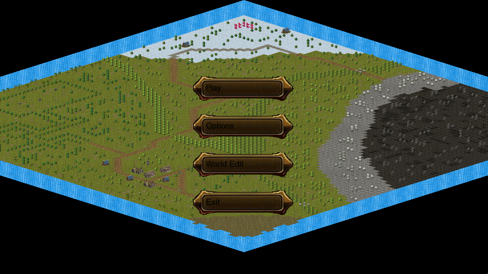
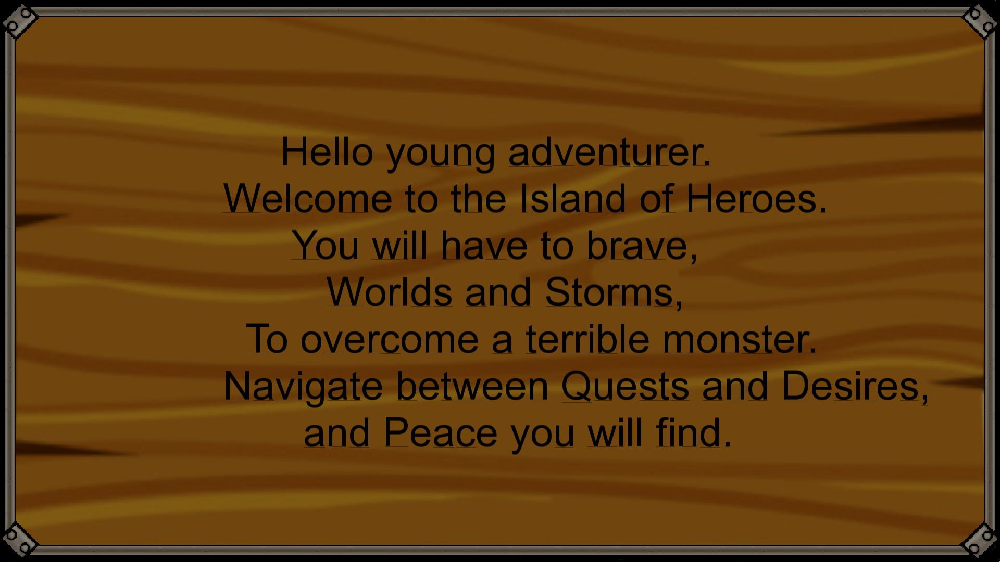
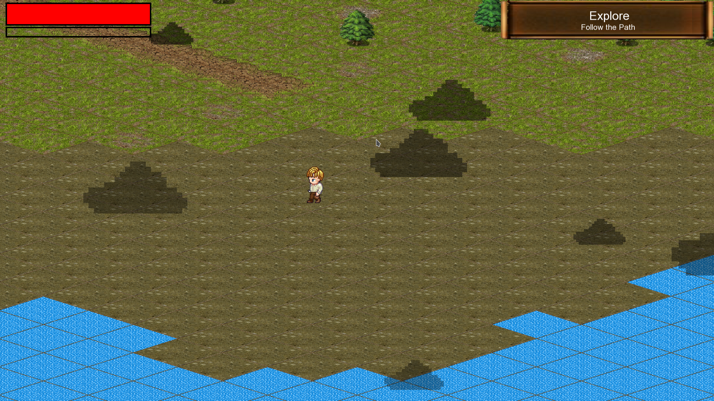
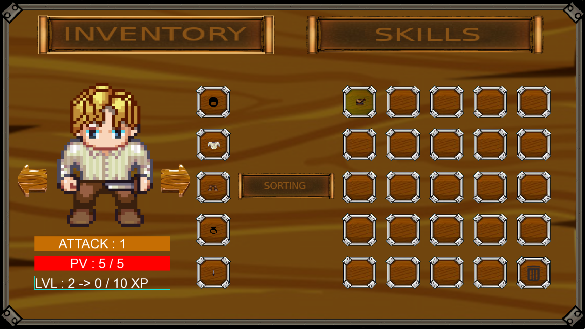
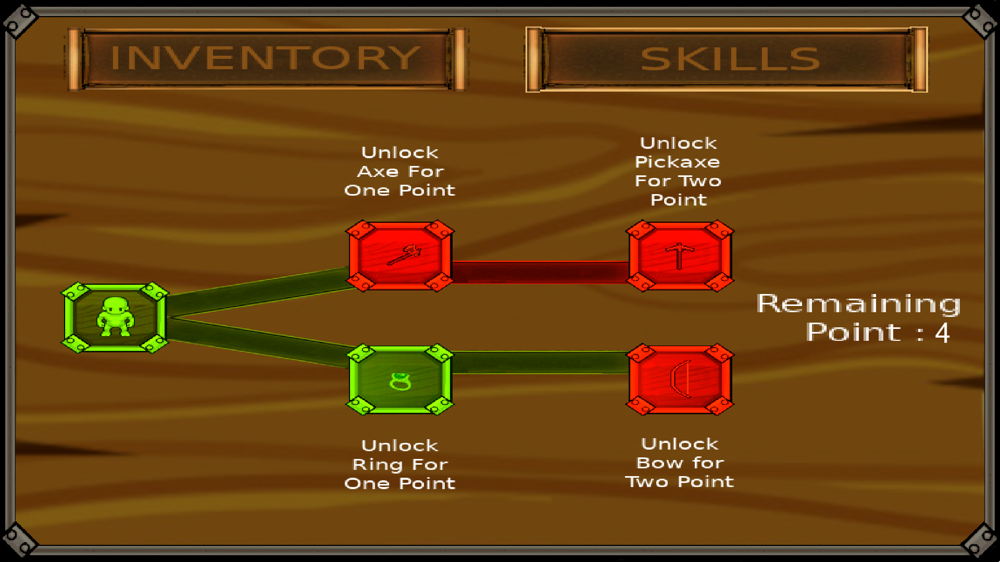
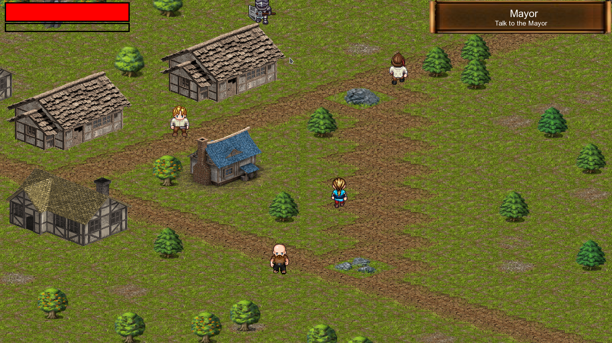
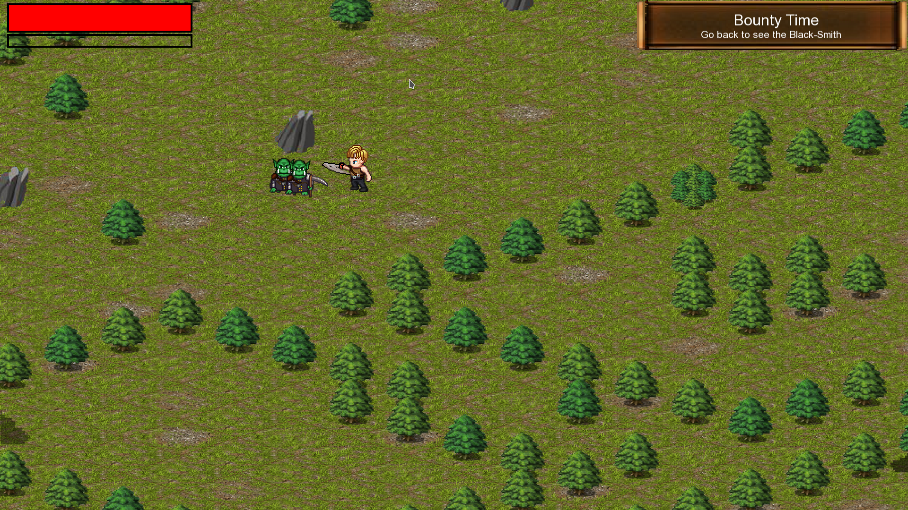
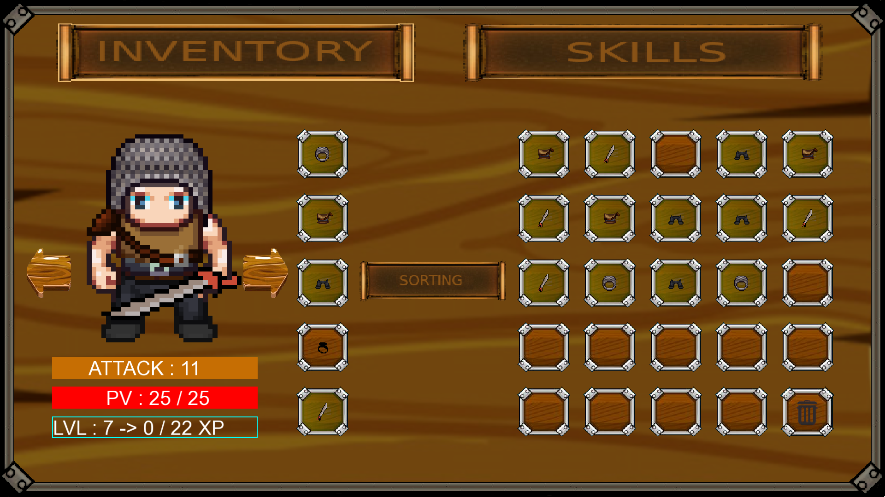
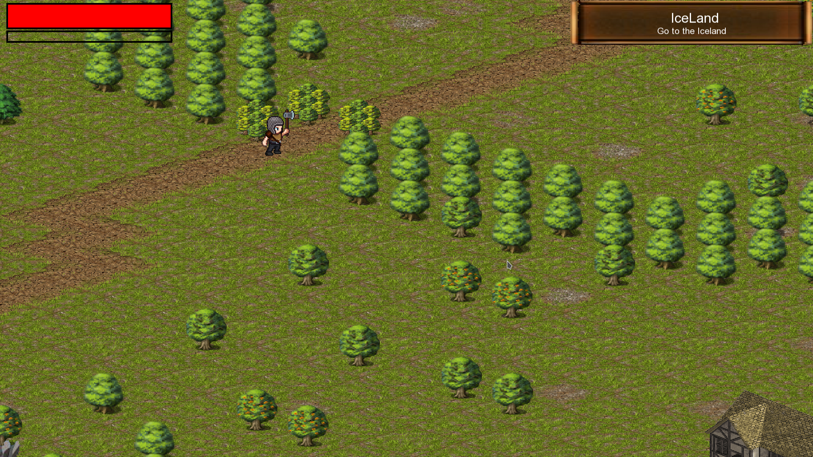
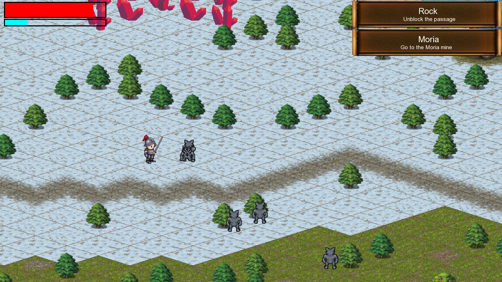
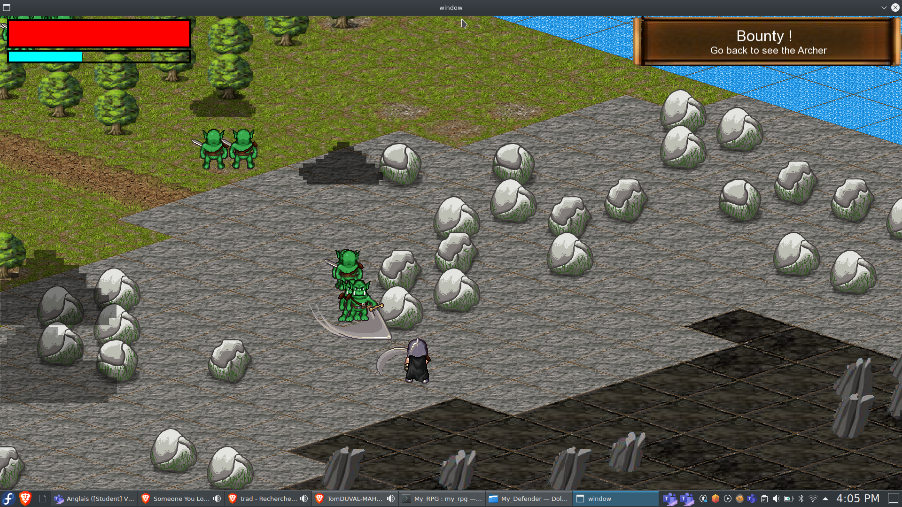
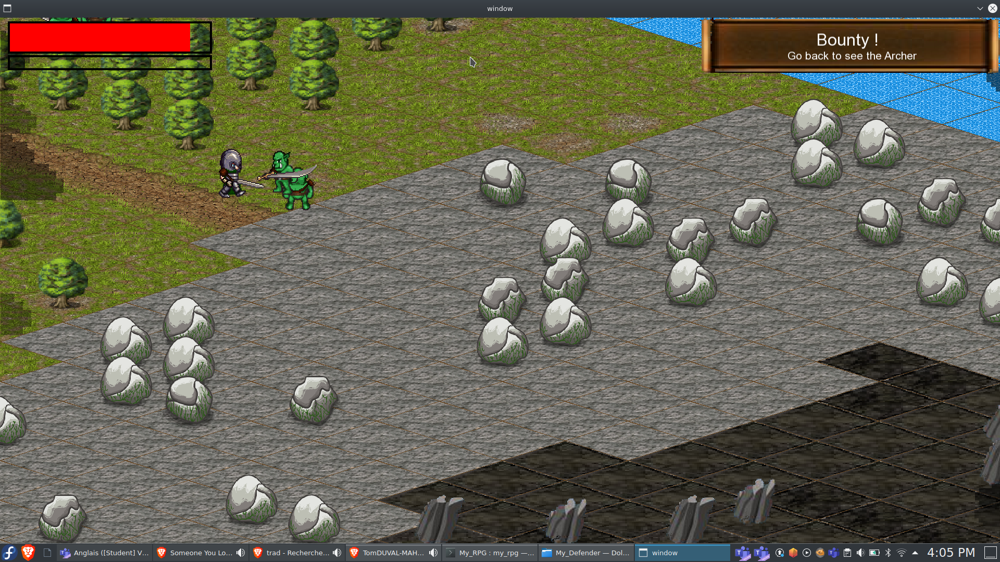
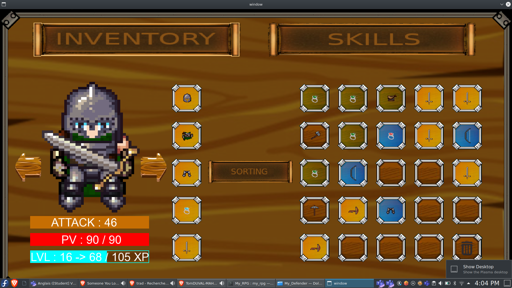